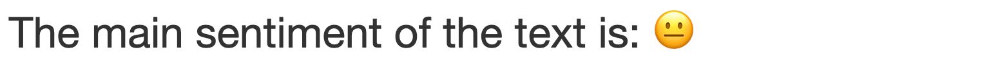

# Project definition Speech Sherlock :male_detective:	

A simple web app for exploring the main content of a text. It is using natural language processing to show the most frequent words used and the main sentiment of the text.
The tool is meant for quick exploration of texts like puplic speeches.

## Project overview
The app is based on [Dash](https://github.com/plotly/dash) and is using natural language toolkit [nltk](https://github.com/nltk/nltk).


Additionally there is a sentiment analysis performed based on [NLTK VADER](https://www.nltk.org/_modules/nltk/sentiment/vader.html) sentiment analysis. The output is mapped to emojis and show the most important sentiment of the text.



Insert any text in the input field and get a chart with most frequent words used. Use the slider for showing the amount of words you are interested in.


Some sample data for exloration of the tool can be found in `data/`

[source for speeches](https://www.fridaysforfuture.org/greta-speeches)


## Problem statement
When you listen to some speech or have some text at hand, it is sometimes hard to get the key messsages delivered. Therfore, it helps to look at the main words used and the sentiment of the text to get standardized information about the content of the speech or text.

## Metrics
The app provides an overview about the most frequent words used. The number of words displayed can be adjusted via a slider. Apart from that the number of words in the text is displayed in the app. Additionally, the sentiment with the highest score of the pre-trained sentiment analysis vader of the nltk toolkit will be displayed as a emoji.

## Analysis
The text is tokenized to word using the word tokenizer from ntlk toolkit. Afterwards stopwords are removed in order to get a better picture of the important words in the text.

### Data Exploration
The data is best explored by inserting it to the input field in the app and check the charts provided.
This will give you the main statistics of the text.

### Data Visualization
The most frequent words used are displayed as interactive plotly bar chart, which can be adjusted using a slider. Additionally, the sentiment analysis of the text is visualizing the sentiment with the highest score as an emoji.


## Methodology
### Data Preprocessing
The text processing is happening in `text.py`. There, the text is tokenized to words, stopwords are removed and only alphanumberic characters are kept.

### Implementation
The tool is using dash for the frontent and some basic text processing and analysis using nltk.

### Refinement
The sentiment analysis returns the scores for `negative`, `neutral`, `positive` and `compound`. Only the most important, meaning the sentiment with the highest score is kept for now. In future it might make sense to use more fine graned analysis of sentiments here.

## Results
### Model Evaluation and Validation
The web app with the most frequent word counter and the sentiment analysis provides a brief overview with main statistics of a text.

## Installation
For installation of the project please run
```
$ make deps
```

## Run the app
To start the app, run
```
$ make run
```

## Go to browser to view the app
```
http://localhost:8050/
```

## Conclusion
The app provides a tool for quick text exploration. There are tons of options to futher improve the existing tool. The statistics of the text could also display more fine grained information about how many and what kind of nouns, ajdectives and verbs were used in the text.
Furthermore, the sentiment analysis model is using the inbuilt pre-trained vader model, which was pre-trained with social media data. Therefore, it might be helpful to use different pre-trained models depending of the kind of text the sentiment analysis should be used for.

## Licence
MIT
